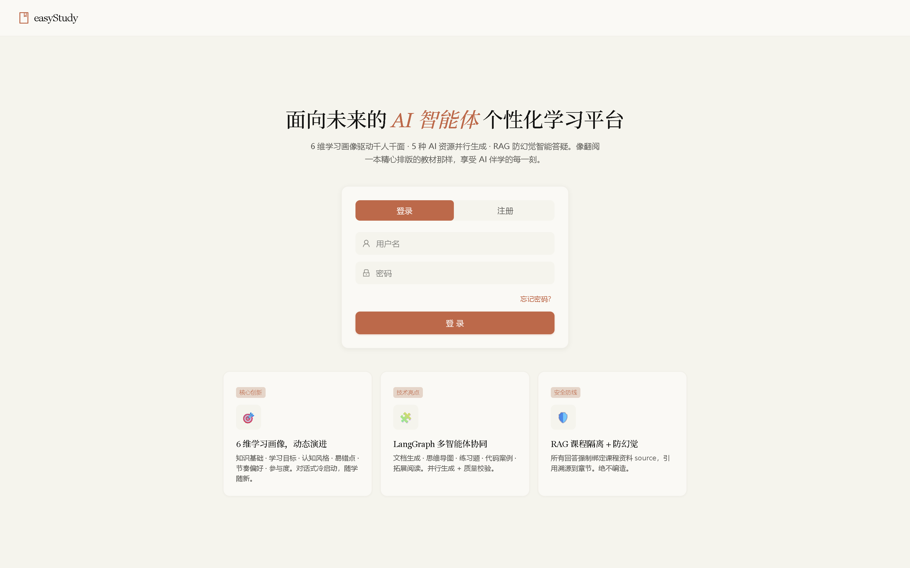
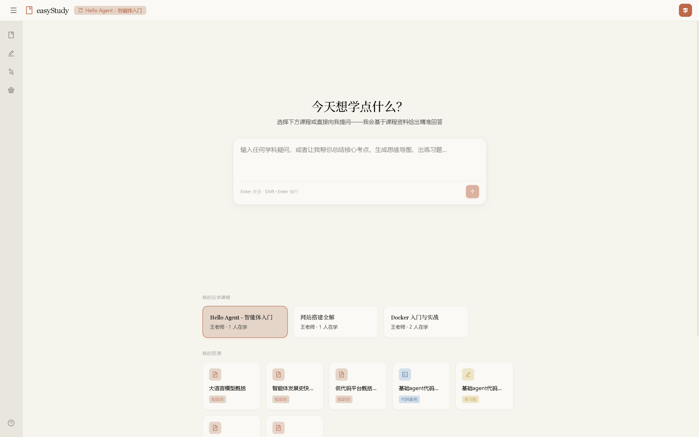
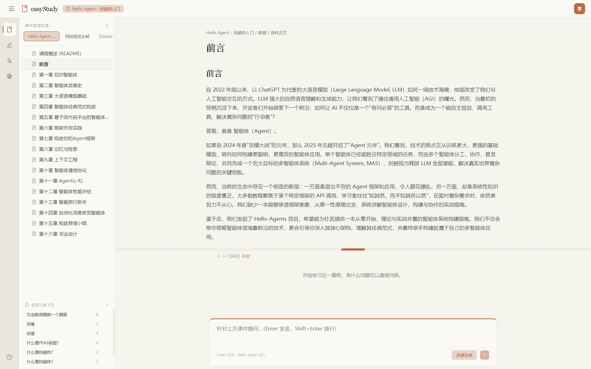
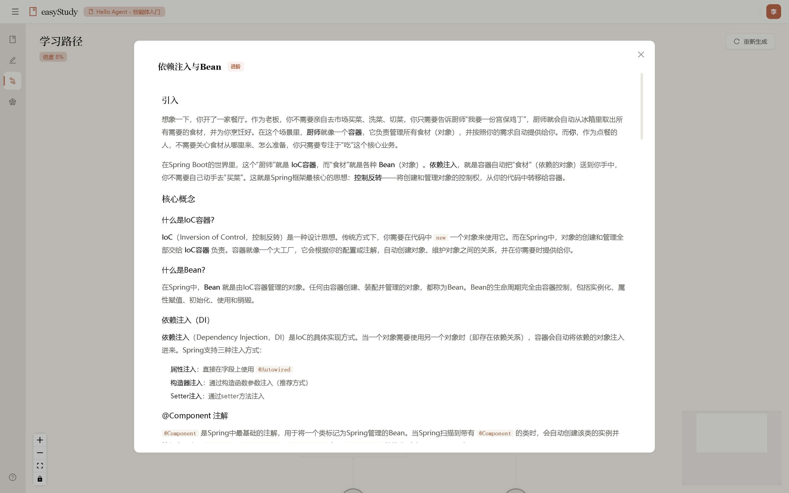
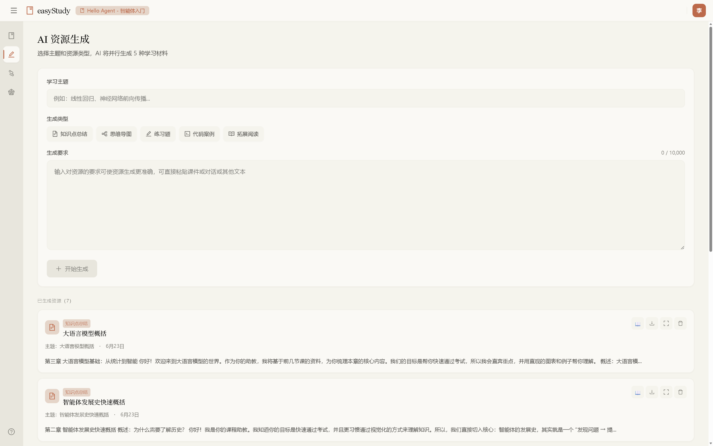
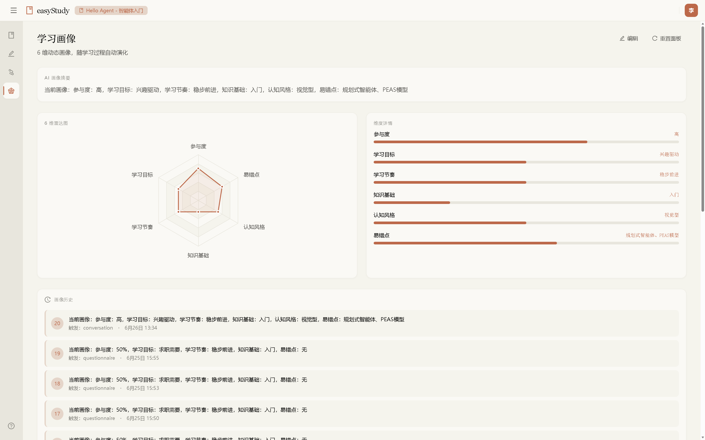

<h1 align="center">EasyStudy</h1>

<p align="center">
  <strong>基于智能体的 AI 学习平台</strong><br />
  界面模拟专业 IDE 工作台，内置 AI 学习助手实时答疑、规划学习路径
</p>

<p align="center">
  <a href="https://github.com/Cretaceous-pc/EasyStudy">GitHub</a> ·
  <a href="https://iocheng.com">个人站</a>
</p>

<br />

## 目录

- [项目背景](#项目背景)
- [架构设计](#架构设计)
- [技术栈](#技术栈)
- [快速启动（Docker）](#快速启动docker)
- [常规启动（本地开发）](#常规启动本地开发)
- [项目结构](#项目结构)
- [效果展示](#效果展示)
- [许可](#许可)

<br />

## 项目背景

传统在线学习平台存在几个痛点：

- **学习路径固定** — 所有学生按同一进度学习，缺乏个性化
- **答疑效率低** — 遇到问题无法即时获得解答
- **学习画像缺失** — 系统不了解学生的知识水平与认知风格
- **教学内容静态** — 所有学生阅读同样的教材，缺乏针对性

EasyStudy 通过 AI Agent 解决以上问题：为每门课程生成个性化的知识图谱学习路径，内置 AI 助教实时答疑，持续构建学生画像并动态调整教学内容。

<br />

## 架构设计

### 整体架构图

```
┌─────────────────────────────────────────────────────────────────────┐
│                          用户层 (Client)                             │
│  ┌──────────────────────────────────────────────────────────────┐   │
│  │              React 前端 (Vite + TypeScript)                    │   │
│  │   ┌─────────┐ ┌──────────┐ ┌──────────┐ ┌───────────────┐   │   │
│  │   │ IDE 界面 │ │ 学习路径  │ │ AI 对话  │ │ 用户画像/管理  │   │   │
│  │   └────┬────┘ └────┬─────┘ └────┬─────┘ └───────┬───────┘   │   │
│  └────────┼───────────┼────────────┼───────────────┼───────────┘   │
└───────────┼───────────┼────────────┼───────────────┼───────────────┘
            │           │            │               │
            ▼           ▼            ▼               ▼
┌─────────────────────────────────────────────────────────────────────┐
│                       API 网关层 (Spring Boot)                        │
│                                                                      │
│   ┌────────────┐  ┌──────────────┐  ┌──────────────────────────┐   │
│   │ 认证/权限   │  │ 课程/报名管理 │  │  AI 代理转发 (Proxy)     │   │
│   │ JWT + RBAC  │  │ CRUD + 分页  │  │  /api/ai/* → FastAPI    │   │
│   └────────────┘  └──────────────┘  └────────────┬─────────────┘   │
│                                                   │                  │
│   ┌───────────────────────────────────────────────┼──────────┐      │
│   │             安全过滤器                          │          │      │
│   │  JwtAuthFilter → 注入 X-User-Id / X-User-Role │          │      │
│   └───────────────────────────────────────────────┼──────────┘      │
└───────────────────────────────────────────────────┼──────────────────┘
                                                    │
                                                    ▼
┌─────────────────────────────────────────────────────────────────────┐
│                     AI 服务层 (FastAPI + LangGraph)                    │
│                                                                      │
│   ┌──────────────┐  ┌────────────────┐  ┌──────────────────────┐   │
│   │  画像系统      │  │  学习路径引擎    │  │  资源生成系统          │   │
│   │               │  │                │  │                      │   │
│   │  画像冷启动     │  │  问卷 → 路径    │  │  AI 生成教学内容       │   │
│   │  ProfileGraph │  │  PathGraph     │  │  智能课件与习题       │   │
│   │  (LangGraph)  │  │  (LangGraph)   │  │                      │   │
│   └───────┬───────┘  └───────┬────────┘  └──────────┬───────────┘   │
│           │                  │                      │               │
│           └──────────────────┼──────────────────────┘               │
│                              │                                      │
│                    ┌─────────▼─────────┐                            │
│                    │    LLM 适配层      │                            │
│                    │  DeepSeek / 讯飞   │                            │
│                    └───────────────────┘                            │
└─────────────────────────────────────────────────────────────────────┘
                      │              │              │
         ┌────────────┼──────────────┼──────────────┼───────────┐
         ▼            ▼              ▼              ▼           ▼
┌──────────────────────────────────────────────────────────────────────┐
│                         中间件层 (Docker)                              │
│                                                                       │
│  ┌──────────┐  ┌──────┐  ┌──────────┐  ┌────────┐  ┌────────────┐  │
│  │PostgreSQL│  │Redis │  │ Chroma   │  │ MinIO  │  │   Qdrant   │  │
│  │ 关系数据库 │  │ 缓存  │  │ 向量数据库 │  │ 文件存储 │  │ (生产可选)  │  │
│  └──────────┘  └──────┘  └──────────┘  └────────┘  └────────────┘  │
└──────────────────────────────────────────────────────────────────────┘
```

### 核心流程

```
用户注册 ──→ 填写学习问卷 ──→ 生成画像 (ProfileGraph)
                                │
                                ▼
  选课 ──→ 生成学习路径 (PathGraph) ──→ 树状知识图谱
                                │
                                ▼
  学习节点 ──→ AI 生成教学内容 ──→ 学习、做习题
                                │
                                ▼
  遇到问题 ──→ AI 助教答疑 (RAG + 上下文) ──→ 持续更新画像
```

### 分层说明

| 层级 | 技术 | 职责 |
|------|------|------|
| **前端** | React 18 + TypeScript + Vite + Ant Design + Zustand | IDE 风格工作台，路由级状态管理 |
| **API 网关** | Spring Boot 3.3 + Spring Security + JWT | 认证授权、业务 CRUD、AI 请求代理 |
| **AI 服务** | FastAPI + LangGraph + LangChain | 画像推理、路径规划、内容生成、智能答疑 |
| **LLM 适配** | DeepSeek API + 讯飞星火 API | 多模型切换，流式 SSE 响应 |
| **数据层** | PostgreSQL + Redis + Chroma + MinIO | 关系数据、缓存、向量存储、文件存储 |

> **设计要点**：前端不直接访问 FastAPI，所有请求经 Spring Boot 网关转发。JWT 在 Spring Boot 验证后，通过 `X-User-Id` / `X-User-Role` 内部头传递给 AI 服务，保证安全。

<br />

## 环境配置

### 配置文件

项目根目录下需要创建 `.env` 文件（参考 `.env.example`），包含以下配置项：

```ini
# ── 数据库 (PostgreSQL) ──
DB_USER=easystudy
DB_PASSWORD=your_db_password_here

# ── 文件存储 (MinIO) ──
MINIO_USER=easystudy_admin
MINIO_PASSWORD=your_minio_password_here

# ── JWT 密钥（生成方式: openssl rand -hex 32） ──
JWT_SECRET=your_64_char_hex_secret_here

# ── DeepSeek API ──
DEEPSEEK_API_KEY=sk-your_deepseek_api_key
DEEPSEEK_BASE_URL=https://api.deepseek.com/v1

# ── 讯飞星火（可选，用于语音/更多模型） ──
XUNFEI_APP_ID=your_app_id
XUNFEI_API_KEY=your_api_key
XUNFEI_API_SECRET=your_api_secret

# ── 邮件 (SMTP，用于找回密码) ──
MAIL_HOST=smtp.qq.com
MAIL_PORT=587
MAIL_USERNAME=your_email@qq.com
MAIL_PASSWORD=your_smtp_authorization_code
MAIL_FROM=your_email@qq.com

# ── 前端 CORS ──
CORS_ALLOWED_ORIGINS=http://localhost:5173
```

> **注意**: `.env` 包含敏感信息，不应提交到 Git。`.env.example` 是模板文件，可安全提交。

### 数据库初始化

PostgreSQL 容器首次启动时会自动执行 `scripts/init-db.sql` 初始化脚本，完成以下操作：

- 创建 `easystudy` 数据库（如不存在）
- 创建核心业务表：`users`（用户）、`roles`（角色）、`user_roles`（用户角色关联）
- 创建课程相关表：`courses`（课程）、`course_enrollments`（选课记录）
- 创建学习路径相关表：`learning_paths`、`path_items`、`path_dependencies`
- 创建画像相关表：`student_profiles`（学生画像）、`profile_snapshots`（画像快照）
- 创建资源相关表：`course_materials`（课程资料）
- 创建对话相关表：`conversations`、`messages`
- 插入初始数据：管理员账户、测试学生账户、示例课程、演示数据

**测试账户**（初始化脚本自动创建）：

| 角色 | 用户名 | 密码 |
|------|--------|------|
| 学生 | `student_li` | `Test@12345` |
| 管理员 | `admin` | `Admin@12345` |

若需重置数据库，删除 `./data/postgres/` 目录后重启容器即可。

### Spring Boot 配置

`backend-spring/src/main/resources/` 下的配置文件：

| 文件 | 用途 |
|------|------|
| `application.yml` | 通用配置：服务端口、JPA、邮件、JWT 过期时间等 |
| `application-dev.yml` | 开发环境配置：数据源、Redis、MinIO、CORS 等 |

这些配置项均通过 `${VAR_NAME:default}` 方式从环境变量读取，优先使用 `.env` 中定义的值。

### FastAPI 配置

`backend-ai/` 下的 AI 服务通过环境变量读取配置，关键变量与 `.env` 对应。启动时 FastAPI 会验证必要的配置项是否已设置。

<br />

## 技术栈

| 类别 | 技术 |
|------|------|
| 前端框架 | React 18 + TypeScript + Vite 8 |
| UI 组件 | Ant Design 6 + @xyflow/react |
| 状态管理 | Zustand |
| API 网关 | Spring Boot 3.3 + Spring Security 6 |
| AI 服务 | FastAPI + LangGraph + LangChain |
| 数据库 | PostgreSQL 16 (关系) + Redis 7 (缓存) |
| 向量存储 | Chroma (开发) / Qdrant (生产) |
| 文件存储 | MinIO (S3 兼容) |
| LLM | DeepSeek + 讯飞星火 |
| 容器化 | Docker Compose |

<br />

## 快速启动（Docker）

### 前置要求

- [Docker](https://docs.docker.com/get-docker/) & [Docker Compose](https://docs.docker.com/compose/install/)
- 配置 `.env` 文件（参考 `.env.example`）填入 API Key

### 启动全部服务

```bash
# 一键启动全部 7 个服务
docker compose up -d --wait
```

### 仅启动中间件（应用层本地开发）

```bash
# 启动中间件
docker compose up -d --wait postgres redis chroma minio

# 新终端启动应用层
cd backend-spring && mvn spring-boot:run                           # Spring Boot → :8080
cd backend-ai   && source .venv/bin/activate && uvicorn main:app --host 0.0.0.0 --port 8000 --reload   # FastAPI → :8000
cd frontend     && npm run dev                                      # 前端 → :5173
```

### 停止服务

```bash
docker compose down
```

<br />

## 常规启动（本地开发）

### 前置要求

- JDK 21+
- Maven 3.9+
- Node.js 22+
- Python 3.13+
- [uv](https://docs.astral.sh/uv/)

### 1. 启动中间件

```bash
docker compose up -d --wait postgres redis chroma minio
```

### 2. 启动 Spring Boot

```bash
cd backend-spring
export JWT_SECRET=your_jwt_secret
export DB_PASSWORD=your_db_password
export MINIO_PASSWORD=your_minio_password
mvn spring-boot:run
```

### 3. 启动 FastAPI AI 后端

```bash
cd backend-ai
uv venv --python 3.13
uv pip install -r requirements.txt
source .venv/bin/activate
uvicorn main:app --host 0.0.0.0 --port 8000 --reload
```

### 4. 启动前端

```bash
cd frontend
npm install
npm run dev
```

### 5. 访问

浏览器打开 **http://localhost:5173**

> **测试账号**: `student_li` / `Test@12345`

<br />

## 项目结构

```
EasyStudy/
├── frontend/                # React 前端 (IDE 风格工作台)
│   └── src/
│       ├── components/      # 组件 (布局/画像/学习路径/AI对话)
│       ├── views/           # 页面视图
│       ├── stores/          # Zustand 状态管理
│       ├── services/        # API 调用层
│       └── types/           # TypeScript 类型定义
│
├── backend-spring/          # Spring Boot API 网关
│   └── src/main/java/com/easystudy/
│       ├── controller/      # REST 控制器 + AI 代理
│       ├── service/         # 业务逻辑
│       ├── repository/      # JPA 数据访问
│       ├── model/           # 实体类
│       ├── dto/             # 数据传输对象
│       ├── security/        # JWT + 过滤器
│       ├── config/          # 安全/文件/MinIO 配置
│       └── exception/       # 全局异常处理
│
├── backend-ai/              # FastAPI AI 服务
│   ├── routers/             # 画像/路径/资源/对话 API
│   ├── graphs/              # LangGraph Agent 定义
│   ├── services/            # 数据库/向量库/MinIO 访问层
│   ├── prompts/             # LLM Prompt 模板
│   └── tools/               # AI 工具函数
│
├── docker-compose.yml       # 全容器化部署
├── 启动.bat / 启动.sh       # 一键启动脚本
├── .env.example             # 环境变量模板
└── scripts/                 # 初始化 SQL 等辅助脚本
```

<br />

## 效果展示

| 页面 | 截图 |
|------|------|
| **登录前首页** |  |
| **登录后首页** |  |
| **课程展示** |  |
| **学习路径** |  |
| **资源生成** |  |
| **用户画像** |  |

<br />

## 许可

本项目仅供个人学习与教育用途。

---

<p align="center">
  Made with ❤️ by <a href="https://iocheng.com">Cheng</a>
</p>
